# 🌏 Overview

**Pigeon Fight** is a free-to-play, fully on-chain game on the **TON network** that brings unique fun and excitement to players directly on Telegram. Compete with others, earn rewards, and enjoy engaging gameplay anytime, anywhere. With **Pigeon Fight**, you can collect and utilize unique NFTs, build your own pigeon military, and battle against other players for ultimate dominance!

# 🎮 Gameplay

All of the game processes are secure, transparent, and entirely on-chain, ensuring that users fully own their minted NFTs. Once minted, the NFT can be used in the game, allowing players to battle, upgrade, and interact with other players.

To start playing **Pigeon Fight**, users need to own at least one NFT pigeon from our collection on the **TON network**. Below is an overview of the gameplay workflow:

## Step 1: Select & Mint an NFT

1. **Choose a Pigeon Class**: Users begin by selecting the pigeon class they want to mint. Each class has unique abilities and characteristics that impact gameplay.
2. **Deposit TON**: Based on the selected class, users deposit the required TON amount to cover the class price.
3. **Mint NFT**: Once the deposit is made, a transaction is initiated on the **TON network**. The smart contract for the NFT collection mints a new NFT, assigning ownership to the user’s wallet address.

The **TON transaction** for NFT minting follows these steps:

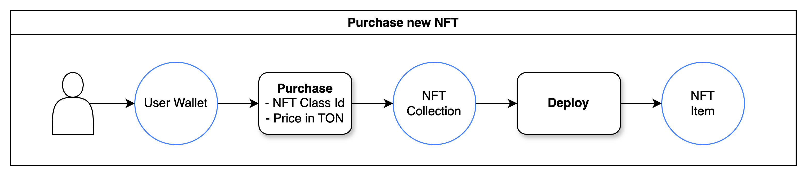

## Step 2: Upgrade Your NFT

1. **Earn Upgrade Points**: Players can gain upgrade points by fighting other NFT pigeons and winning battles.
2. **Select an NFT to Upgrade**: When enough upgrade points are collected, the user can choose an NFT from their collection to upgrade.
3. **Send an Upgrade Message**: To initiate the upgrade, the player sends a message to the NFT smart contract, specifying which attributes to enhance.
4. **Attribute Enhancement**: Players can allocate upgrade points to any of the following five attributes:
   - **Health Point (HP)**: Increases the durability of the NFT in battle.
   - **Energy**: Allows for more battles or actions in the game.
   - **Attack**: Enhances the offensive power against other NFT pigeons.
   - **Defense**: Reduces the damage taken during battles.
   - **Speed**: Improves the chance of striking first in battle.

With each upgrade, the pigeon NFT becomes stronger and better equipped for future battles, creating a continuous gameplay loop where players can strengthen their assets and face increasingly challenging opponents.

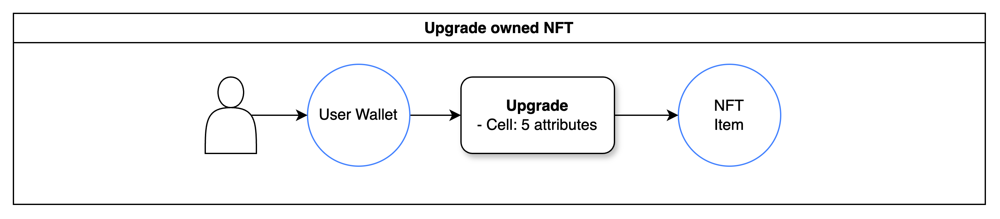

## Step 3: Challenge Opponents & Earn Experience

1. **Find an Opponent**: Users can browse and select an opponent NFT pigeon to challenge, keeping in mind that they need to choose an opponent they have a high chance of defeating to gain experience points.
2. **Battle On-Chain**: The battle takes place fully on-chain, with the outcome determined by comparing the stats of both NFTs. Each pigeon’s **Attack**, **Defense**, **HP**, **Energy**, and **Speed** attributes are used to calculate the winner.
3. **Earn Experience Points**: Winning against a more powerful opponent earns more experience points, which can later be used for upgrades.
4. **Update Attributes**: After the battle, both pigeons’ **Health Point (HP)** and **Energy** attributes are updated based on the battle’s outcome. This adjustment reflects the toll taken by each pigeon during the fight.

Each battle provides a new opportunity for players to advance, upgrade, and strengthen their NFTs, making each victory a step toward creating the ultimate pigeon fighter.

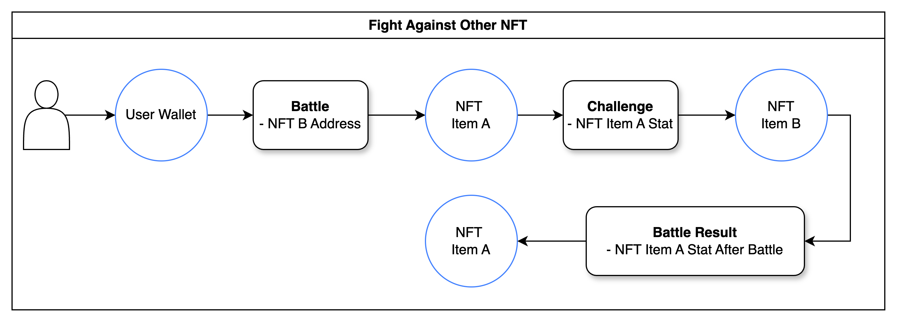

## Step 4: Healing Your NFT

1. **Maintain Optimal Health & Energy**: To maximize the chances of winning, players must ensure that their NFT pigeon remains in peak condition with high **HP** and **Energy**.
2. **Purchase Healing Items**: Players can buy healing items from the in-game shop to restore their NFT’s health and energy. Different items offer varying effects, such as:
   - **Potion**: Restores full health and energy.
   - **Onigiri**: Restores half of the health.
   - **Hotdog**: Fully restores health.
   - **Orange**: Restores half of the energy.
   - **Popcorn**: Fully restores energy.
3. **Price Variation**: Each healing item has a different price, based on its effectiveness. Strategic item selection ensures players get the best value for the recovery needs of their NFT.

By keeping their NFTs in optimal condition through regular healing, players can increase their winning potential in battles, making each fight a rewarding step toward mastery.

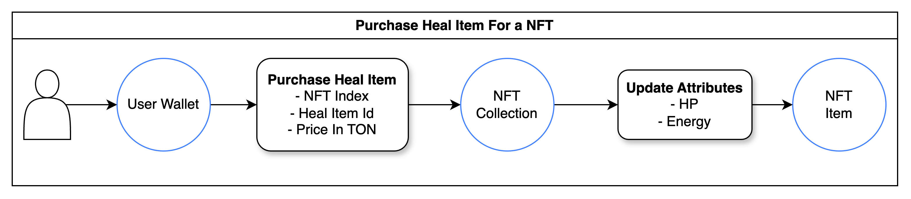

# 🐧 Pigeon Fight Collection - NFT Class

Pigeon Fight NFT Collection - 23 NFT classes

| Class             | Image                                            | Bonus Attack - Defense - Speed | Evolvability |
| ----------------- | ------------------------------------------------ | ------------------------------ | ------------ |
| Baker 🥖👩‍🍳        | 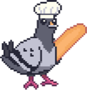        | 5 - 0 - 0                      | 🚫           |
| Bat 🦇            | 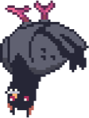          | 1 - 1 - 1                      | 🚫           |
| Charlie 🎩🕴️      | 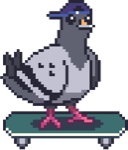      | 0 - 0 - 5                      | 🚫           |
| Crusader 🛡️⚔️     | 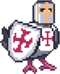     | 0 - 3 - 0                      | ✅           |
| DoubleWinged 🕊️🕊️ | 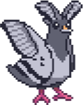 | 0 - 0 - 3                      | ✅           |
| EGirl 💄🎧        | 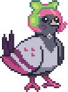        | 0 - 0 - 0                      | 🚫           |
| Fridgeon 🧊❄️     | 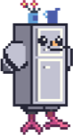     | 0 - 3 - 0                      | 🚫           |
| God 🌩️🕊️          | 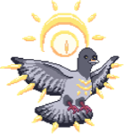          | 3 - 3 - 3                      | 🚫           |
| Hatoshi 🧠🔗      | 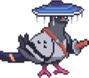      | 0 - 0 - 3                      | 🚫           |
| Infiltrator 🕵️‍♂️⚡  | 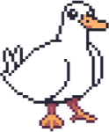  | 1 - 1 - 1                      | ✅           |
| Kawaii 💖🎀       | 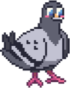       | 0 - 0 - 0                      | ✅           |
| Knight ⚔️🛡️       | 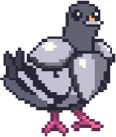       | 0 - 3 - 0                      | ✅           |
| Mimic 🎭🔍        | 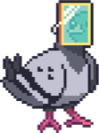        | 0 - 5 - 0                      | 🚫           |
| Normal 🐦         | 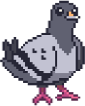       | 0 - 0 - 0                      | ✅           |
| Pi 🔢🍰           | 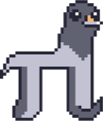           | 0 - 0 - 5                      | 🚫           |
| Platy 🦆🌊        | 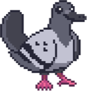        | 1 - 1 - 1                      | ✅           |
| Selfie 📸💁‍♀️       | 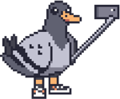       | 5 - 0 - 0                      | 🚫           |
| Sink 🚰🧼         | 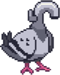         | 0 - 5 - 0                      | 🚫           |
| StrongA 🏋️‍♂️💪      | 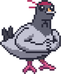      | 3 - 0 - 0                      | ✅           |
| Whey 💪🥛         | 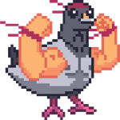         | 3 - 0 - 0                      | ✅           |
| Winged 🕊️💨       | 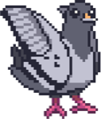       | 0 - 0 - 3                      | ✅           |
| Wizzard 🧙‍♂️✨      | 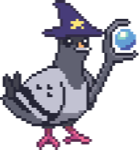      | 5 - 0 - 0                      | 🚫           |
| Wyrm 🐉🔥         | 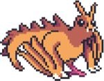         | 3 - 0 - 0                      | 🚫           |

# 🤼 Community

**Follow Us on Social Media**

Stay updated with our latest news and announcements:

- [Website](https://pigeon-fight.xyz)
- [Game](https://game.pigeon-fight.xyz)
- [Twitter](https://x.com/HoaLe_58)
- [Telegram](https://t.me/pigeonfightxyz)
